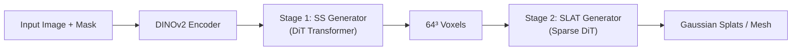

# Agent Guidelines for SAM-3D TVM Port

> **Project Goal**: Port SAM-3D-Objects from PyTorch to Apache TVM for optimized inference deployment.

---

## Quick Start Checklist

1. Read `NOTES/SAM-3D-ANALYSIS.md` for model architecture understanding
2. Review `pyproject.toml` for pixi/dependency setup
3. Check `NOTES/` for experiment logs and findings
4. Use `pixi run <task>` for all development commands

---

## Project Structure

```
sam-3d-tvm/
├── AGENTS.md                  # This file - agent onboarding
├── NOTES/                     # Documentation & experiment logs
│   ├── SAM-3D-ANALYSIS.md     # Detailed SAM-3D architecture analysis
│   └── *.md                   # Experiment logs, findings, progress
├── external/
│   ├── sam-3d-objects/        # Reference PyTorch implementation (READ-ONLY)
│   └── tvm/                   # Apache TVM source (git submodule)
├── src/sam_3d_tvm/            # Our TVM implementation
│   ├── models/                # TVM model implementations
│   ├── scripts/               # Porting & validation scripts
│   └── cli/                   # Command-line tools
├── scripts/                   # Build scripts (build_tvm.sh)
├── tests/                     # Test suite
└── pyproject.toml             # Pixi & project config
```

---

## Development Environment

### Pixi Commands

```bash
pixi install              # Setup environment
pixi run build-tvm        # Build TVM from source (uses LLVM, no CUDA)
pixi run test             # Run tests
pixi run lint             # Ruff linter
pixi run format           # Ruff formatter
```

### TVM Integration

- TVM is installed as editable PyPI dep from `external/tvm/python`
- TVM-FFI is at `external/tvm/3rdparty/tvm-ffi`
- Build script: `scripts/build_tvm.sh` (LLVM only, no GPU backends currently)

---

## SAM-3D Architecture Summary



### Key Components to Port

| Priority | Component | Source File | Complexity |
|----------|-----------|-------------|------------|
| 1 | DINOv2 Encoder | `model/backbone/dit/embedder/dino.py` | Medium |
| 2 | SS Flow Model | `model/backbone/tdfy_dit/models/sparse_structure_flow.py` | High |
| 3 | SS VAE Decoder | `model/backbone/tdfy_dit/models/sparse_structure_vae.py` | Medium |
| 4 | SLAT Flow Model | `model/backbone/tdfy_dit/models/structured_latent_flow.py` | High |
| 5 | GS Decoder | `model/backbone/tdfy_dit/representations/gaussian/` | Medium |

### Critical Challenges

1. **SparseTensor Operations**: Custom sparse tensor class with batching
2. **Flash Attention**: May need custom TVM implementation
3. **Sparse Convolutions**: torchsparse/spconv backends
4. **Flow Matching ODE**: Multi-step sampling loop

---

## TVM Porting Strategy

### Approach: `torch.export` + Relax Frontend

```python
import torch
from tvm.relax.frontend.torch import from_exported_program

# 1. Export PyTorch model
exported = torch.export.export(model, example_inputs)

# 2. Convert to Relax IR
mod = from_exported_program(exported, keep_params_as_input=True)

# 3. Apply optimizations
with tvm.transform.PassContext(opt_level=3):
    mod = tvm.relax.transform.LegalizeOps()(mod)
    
# 4. Build and deploy
ex = tvm.relax.build(mod, target="llvm")
vm = tvm.relax.VirtualMachine(ex, tvm.cpu())
```

### Recommended Approach

1. **Start Simple**: Port DINOv2 encoder first (standard ViT)
2. **Incremental**: Each component validated against PyTorch
3. **Document Blockers**: Track unsupported ops in NOTES/
4. **Fallback Strategy**: Hybrid TVM + PyTorch for complex ops

---

## Coding Standards

- **Clean & Concise**: Follow project ruff settings (120 char lines)
- **Type Hints**: Full typing for all functions
- **Documentation**: Docstrings for public APIs
- **Testing**: Tests for each ported component
- **NOTES/**: Log all experiments, findings, blockers

---

## Key Files Reference

### SAM-3D Reference (external/sam-3d-objects/)

- `sam3d_objects/pipeline/inference_pipeline.py` - Main inference orchestration
- `sam3d_objects/model/backbone/dit/embedder/dino.py` - DINOv2 encoder
- `sam3d_objects/model/backbone/tdfy_dit/models/` - Generator models
- `sam3d_objects/model/backbone/tdfy_dit/modules/sparse/` - SparseTensor ops

### TVM Reference (external/tvm/)

- `python/tvm/relax/frontend/torch/` - PyTorch importer
- `python/tvm/relax/transform/` - IR transformations
- `tests/python/relax/test_*.py` - Test examples

---

## Common Issues & Solutions

| Issue | Solution |
|-------|----------|
| TVM not found | Run `pixi install` then `pixi run build-tvm` |
| Missing LLVM | Install via apt: `sudo apt install llvm-dev` |
| Op not supported | Check TVM op registry, may need custom impl |
| SparseTensor | May need to densify or implement sparse ops |

---

## Next Steps Guidance

When continuing this project:

1. Check `NOTES/` for latest progress and blockers
2. Run `pixi run test` to validate environment
3. Start with smallest untested component
4. Log all experiments in `NOTES/YYYY-MM-DD-<topic>.md`

---

## Resources

- [TVM Relax Tutorial](https://tvm.apache.org/docs/tutorial/)
- [torch.export Documentation](https://pytorch.org/docs/stable/export.html)
- [SAM-3D Paper](https://arxiv.org/abs/2511.16624)
- Existing analysis: `NOTES/SAM-3D-ANALYSIS.md`