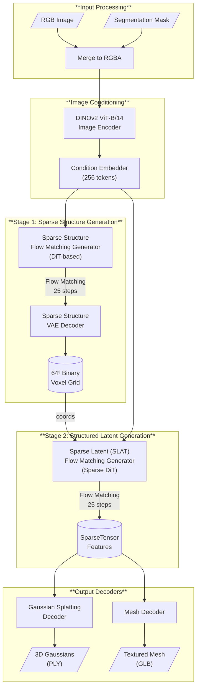
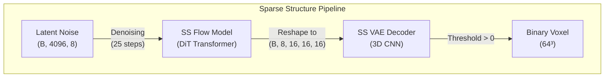
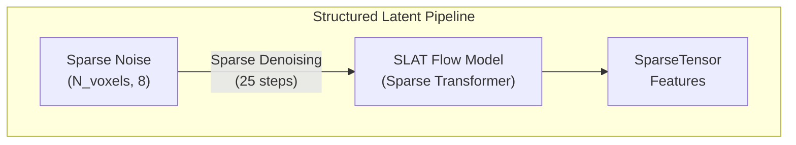
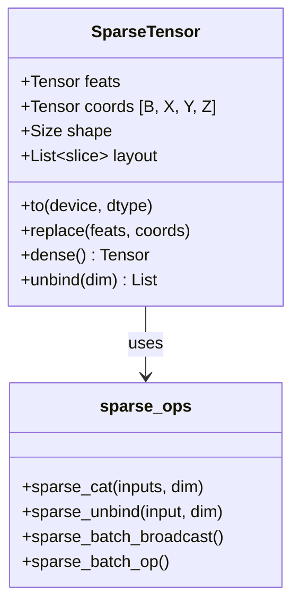
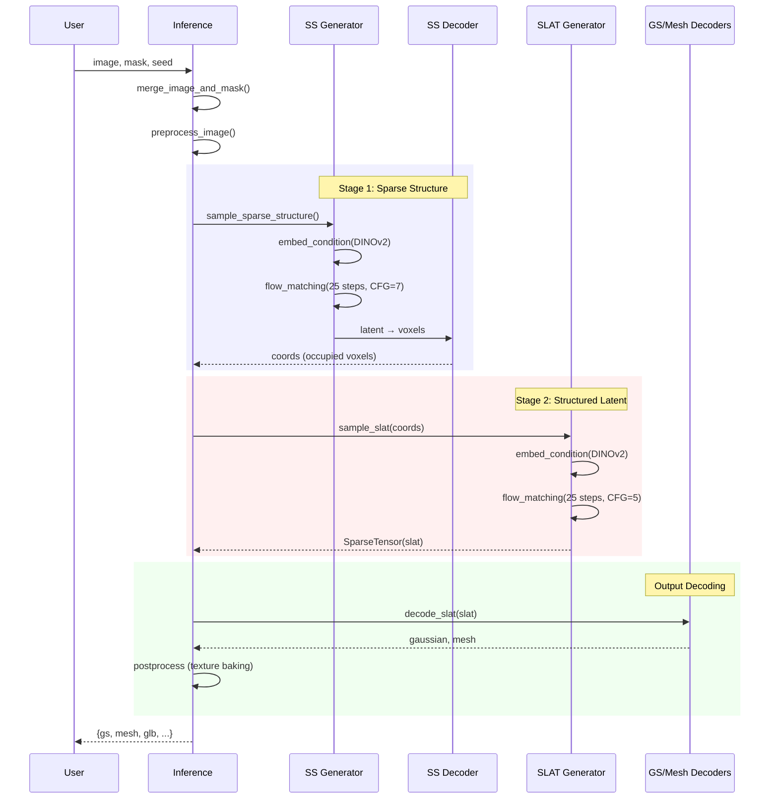

# SAM-3D Objects: Theory of Operation

> **SAM 3D Objects** is a foundation model from Meta that reconstructs full 3D shape geometry, texture, and layout from a single image. It excels in real-world scenarios with occlusion and clutter using progressive training and a human-feedback-enhanced data engine.

---

## System Architecture Overview



---

## Core Pipeline Stages

### Stage 1: Sparse Structure Generation

The first stage predicts a **coarse 3D occupancy grid** from the input image:



**Key characteristics:**
- Generates a **16³ latent cube** with 8 channels, then upsamples to **64³ voxels**
- Uses Classifier-Free Guidance (CFG) with strength=7
- Flow matching with rectified flow for stable generation
- Outputs coordinates of occupied voxels for Stage 2

### Stage 2: Structured Latent (SLAT) Generation

The second stage generates **detailed 3D features** at occupied voxel locations:



**Key characteristics:**
- Operates only on **occupied voxel coordinates** from Stage 1
- Uses `SparseTensor` representation for memory efficiency
- Sparse attention with coordinate-aware positional embeddings
- CFG with strength=5 for balanced quality/diversity

---

## Key Components

### Model Architecture Components

| Component | Class | Purpose | Key Features |
|-----------|-------|---------|--------------|
| **SS Generator** | `SparseStructureFlowModel` | Generates 3D structure latent | DiT-style transformer, cross-attention to image tokens |
| **SLAT Generator** | `SLatFlowModel` | Generates sparse 3D features | Sparse transformer with SparseResBlock3d |
| **SS Decoder** | `SparseStructureDecoder` | Decodes latent to voxels | 3D CNN with upsampling blocks |
| **GS Decoder** | (in `representations/gaussian`) | Decodes to Gaussians | Predicts xyz, rotation, scaling, opacity, SH colors |
| **Mesh Decoder** | (in `representations/mesh`) | Decodes to mesh | Predicts vertices and faces |
| **Condition Embedder** | `Dino` | Encodes input image | DINOv2 ViT-B/14, 256 output tokens |

### Flow Matching with CFG

| Parameter | SS Generator | SLAT Generator |
|-----------|-------------|----------------|
| **Inference Steps** | 25 | 25 |
| **CFG Strength** | 7.0 | 5.0 |
| **CFG Interval** | [0, 500] | [0, 500] |
| **Rescale t** | 3 | 3 |

---

## Sparse Tensor Representation

SAM-3D uses a custom `SparseTensor` class that supports both **torchsparse** and **spconv** backends:



**Features:**
- **Batch dimension in coords[:, 0]** - contiguous data per batch
- **Layout slices** track per-batch data ranges
- **Spatial cache** for efficient repeated operations
- Supports element-wise operations (+, -, *, /)

---

## Gaussian Splatting Output

The `Gaussian` class represents 3D Gaussian splats:

| Attribute | Shape | Description |
|-----------|-------|-------------|
| `xyz` | (N, 3) | 3D positions |
| `scaling` | (N, 3) | Gaussian scales (log-space) |
| `rotation` | (N, 4) | Quaternion rotations |
| `opacity` | (N, 1) | Opacity values (sigmoid-inverse) |
| `features_dc` | (N, 3) | Base RGB (SH degree 0) |
| `features_rest` | (N, 45) | Higher SH coefficients |

---

## Inference Pipeline Flow



---

## Directory Structure

```
sam3d_objects/
├── model/
│   ├── backbone/
│   │   ├── dit/
│   │   │   └── embedder/
│   │   │       ├── dino.py          # DINOv2 image encoder
│   │   │       └── pointmap.py       # Optional point cloud conditioning
│   │   ├── generator/
│   │   │   ├── classifier_free_guidance.py  # CFG wrapper
│   │   │   └── flow_matching/        # Flow matching samplers
│   │   └── tdfy_dit/
│   │       ├── models/
│   │       │   ├── sparse_structure_flow.py    # Stage 1 generator
│   │       │   ├── structured_latent_flow.py   # Stage 2 generator
│   │       │   └── sparse_structure_vae.py     # VAE encoder/decoder
│   │       ├── modules/
│   │       │   ├── sparse/           # SparseTensor, sparse conv/attention
│   │       │   └── transformer/      # Transformer blocks
│   │       └── representations/
│   │           ├── gaussian/         # 3D Gaussian output
│   │           └── mesh/             # Mesh output
│   └── io.py                         # Model loading utilities
├── pipeline/
│   ├── inference_pipeline.py         # Main inference orchestration
│   ├── inference_utils.py            # Helper functions
│   └── layout_post_optimization_utils.py  # Scene optimization
├── data/
│   └── dataset/                      # Data loading
└── utils/
    └── visualization.py              # Scene visualization
```

---

## Key Technical Insights

### 1. Two-Stage Generation
- **Stage 1** focuses on coarse geometry (where is the object?)
- **Stage 2** focuses on detailed appearance (what does it look like?)
- This decomposition enables handling of complex occlusions

### 2. Sparse Representations
- Only process occupied voxels → memory efficient for high resolution
- SparseTensor abstracts torchsparse/spconv backends
- Enables scaling to 64³ and beyond

### 3. Flow Matching
- Uses rectified flows for generation (not DDPM/DDIM)
- `rescale_t=3` concentrates steps near t=0 (denoising end)
- CFG applied with strength interpolation over timesteps

### 4. Multi-Modal Outputs
- Same latent can decode to **Gaussian Splats** (for rendering) or **Mesh** (for export)
- Texture baking projects Gaussian colors onto mesh UVs
- GLB export with simplification (95% triangle reduction)

### 5. torch.compile Support
- `_compile()` method enables max-autotune compilation
- Wraps condition embedder, SS generator, and SS decoder
- Warmup runs for kernel specialization

---

## Model Size & Resources

| Model Component | Approximate Parameters |
|-----------------|----------------------|
| DINOv2 ViT-B/14 | ~86M |
| SS Generator (DiT) | ~300M |
| SLAT Generator (Sparse DiT) | ~400M |
| SS Decoder (3D CNN) | ~20M |
| SLAT Decoder GS | ~50M |
| SLAT Decoder Mesh | ~50M |

**Requirements:**
- GPU with 16GB+ VRAM recommended
- CUDA support required
- Flash Attention enabled for A100/H100/H200

---

## References

- **Paper**: [SAM 3D: 3Dfy Anything in Images](https://arxiv.org/abs/2511.16624)
- **Code**: [github.com/facebookresearch/sam-3d-objects](https://github.com/facebookresearch/sam-3d-objects)
- **Related**: [SAM 3D Body](https://github.com/facebookresearch/sam-3d-body) for human mesh recovery
