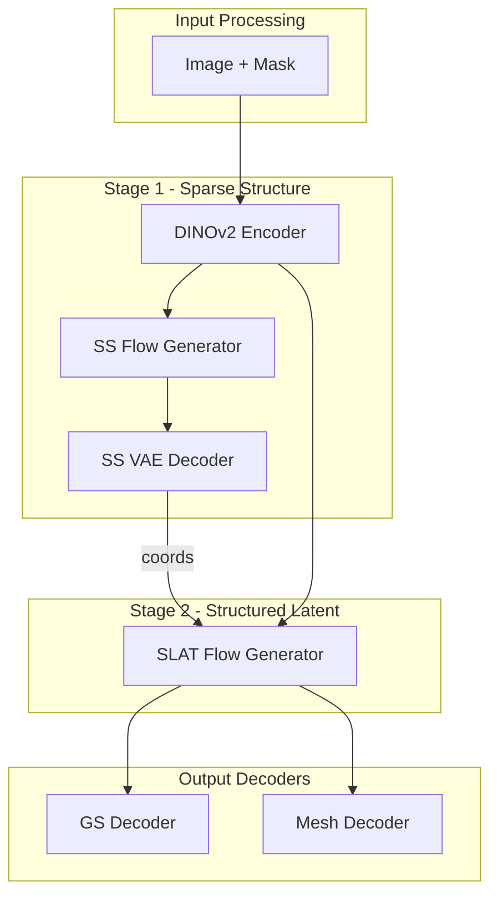

# SAM-3D TVM Porting Strategy

> **Status**: Initial planning complete  
> **Last Updated**: 2025-12-17

---

## Executive Summary

SAM-3D-Objects is a complex 2-stage generative model with:
- **~900M parameters** across multiple components
- **Flow matching** inference (25-step ODE solving per stage)
- **SparseTensor** operations for memory efficiency
- **DINOv2** vision transformer backbone

This document outlines a systematic approach to port from PyTorch to TVM.

---

## Component Dependency Graph



**Porting Order** (by dependency):
1. DINOv2 Encoder (no deps, standard ViT)
2. SS VAE Decoder (3D CNN, straightforward)
3. SS Flow Generator (DiT + attention)
4. SLAT Flow Generator (Sparse DiT - hardest)
5. GS Decoder (MLP-based)

---

## Op Compatibility Analysis

### DINOv2 Encoder (High Compatibility)

| Op | TVM Support | Notes |
|----|-------------|-------|
| Linear | ✅ Full | Standard matmul |
| LayerNorm | ✅ Full | Native op |
| GELU | ✅ Full | Native op |
| Softmax | ✅ Full | Native op |
| Attention | ✅ Relax | May need manual impl for flash |

### SS VAE Decoder (High Compatibility)

| Op | TVM Support | Notes |
|----|-------------|-------|
| Conv3d | ✅ Full | Native op |
| GroupNorm | ✅ Full | Native op |
| Upsample | ✅ Full | Native op |
| SiLU | ✅ Full | Native op |

### SS Flow Generator (Medium Compatibility)

| Op | TVM Support | Notes |
|----|-------------|-------|
| AdaLayerNorm | ⚠️ Custom | Need to compose ops |
| CrossAttention | ⚠️ Partial | May need custom |
| FlashAttention | ❌ No | Fallback to standard attention |

### SLAT Flow Generator (Low Compatibility)

| Op | TVM Support | Notes |
|----|-------------|-------|
| SparseTensor | ❌ No | **Blocker** - need workaround |
| SparseConv3d | ❌ No | torchsparse/spconv specific |
| SparseAttention | ❌ No | Custom implementation |

### Gaussian Decoder (High Compatibility)

| Op | TVM Support | Notes |
|----|-------------|-------|
| Linear | ✅ Full | MLP layers |
| Activation | ✅ Full | Various activations |

---

## Strategy for Unsupported Ops

### Option A: Densify SparseTensors
- Convert sparse coords to dense 64³ grid
- Pros: Full TVM support
- Cons: Higher memory, slower

### Option B: Custom TVM Op
- Implement sparse ops in TViewModel IR
- Pros: Efficient, proper solution
- Cons: Significant development effort

### Option C: Hybrid Execution
- Run dense ops in TVM, sparse in PyTorch
- Pros: Quick to implement
- Cons: Data transfer overhead

**Recommendation**: Start with Option C (hybrid), migrate to Option A if sparse ops prove costly.

---

## TVM Relax Workflow

```python
import torch
import tvm
from tvm.relax.frontend.torch import from_exported_program

def port_component(model, example_inputs, name):
    """General workflow for porting a component."""
    
    # 1. Export from PyTorch
    exported = torch.export.export(
        model.eval(),
        example_inputs,
        strict=False  # Allow dynamic shapes
    )
    
    # 2. Convert to TVM Relax IR
    mod = from_exported_program(
        exported,
        keep_params_as_input=True,
        run_ep_decomposition=True  # Decompose high-level ops
    )
    
    # 3. Apply optimizations
    with tvm.transform.PassContext(opt_level=3):
        mod = tvm.relax.transform.LegalizeOps()(mod)
        mod = tvm.relax.transform.FoldConstant()(mod)
        mod = tvm.relax.transform.DeadCodeElimination()(mod)
    
    # 4. Build for target
    ex = tvm.relax.build(mod, target="llvm")
    vm = tvm.relax.VirtualMachine(ex, tvm.cpu())
    
    return vm
```

---

## Validation Protocol

For each ported component:

1. **Numerical Validation**
   ```python
   # Compare outputs
   torch_out = pytorch_model(inputs)
   tvm_out = tvm_model(inputs)
   max_error = np.abs(torch_out - tvm_out).max()
   assert max_error < 1e-5, f"Max error: {max_error}"
   ```

2. **Shape Validation**
   ```python
   assert torch_out.shape == tvm_out.shape
   ```

3. **Performance Timing**
   ```python
   # Benchmark both implementations
   torch_time = timeit(lambda: pytorch_model(inputs), number=100)
   tvm_time = timeit(lambda: tvm_model(inputs), number=100)
   speedup = torch_time / tvm_time
   ```

---

## Risk Assessment

| Risk | Likelihood | Impact | Mitigation |
|------|------------|--------|------------|
| SparseTensor incompatibility | High | High | Hybrid execution / densify |
| Flash attention missing | Medium | Low | Standard attention fallback |
| torch.export failures | Medium | Medium | Use dynamo_capture_subgraphs |
| Numerical precision drift | Low | Medium | Increase tolerance, compare end-to-end |

---

## Milestones

### Milestone 1: Environment Ready
- [ ] TVM builds successfully
- [ ] Can import TVM Relax
- [ ] Basic torch export → Relax works

### Milestone 2: First Component
- [ ] DINOv2 ported to TVM
- [ ] Validated against PyTorch
- [ ] Benchmarked

### Milestone 3: Stage 1 Complete
- [ ] SS Generator + Decoder ported
- [ ] Can generate voxel structure from image

### Milestone 4: Full Pipeline
- [ ] All components ported or hybrid
- [ ] End-to-end inference works
- [ ] Performance acceptable

---

## Resources

- [TVM Relax Docs](https://tvm.apache.org/docs/reference/api/python/relax)
- [torch.export Guide](https://pytorch.org/docs/stable/export.html)
- [SAM-3D Paper](https://arxiv.org/abs/2511.16624)
- [Vision Transformer (ViT)](https://arxiv.org/abs/2010.11929)
- [DINOv2](https://arxiv.org/abs/2304.07193)
